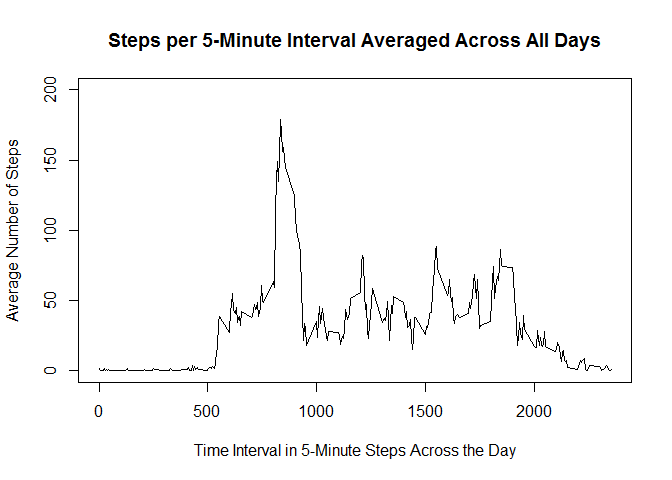
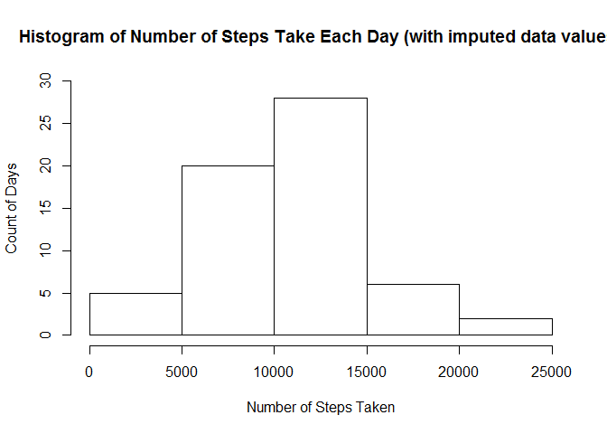

# Reproducible Research: Peer Assessment 1

# Loading and preprocessing the data
Data is read in from a local file "activity.csv". This is a CSV file with 3 
columns:  
- **steps**:an integer, count of steps taken in the interval, this contains 
NA values  
- **date**: the date of the observation  , in yyyy-mm-dd format  
- **interval**: an integer, the time interval over which the observation was 
taken in 5 minute increments  

**NOTE** that the activity.csv file must have been downloaded from GitHub 
(https://github.com/NeilStrange/RepData_PeerAssessment1) and unzipped into 
the local working directory prior to running this analysis.


```r
library(dplyr)
```

```
## 
## Attaching package: 'dplyr'
## 
## The following objects are masked from 'package:stats':
## 
##     filter, lag
## 
## The following objects are masked from 'package:base':
## 
##     intersect, setdiff, setequal, union
```

```r
data <- read.csv("activity.csv", header = TRUE, sep = ",")
head(data)
```

```
##   steps       date interval
## 1    NA 2012-10-01        0
## 2    NA 2012-10-01        5
## 3    NA 2012-10-01       10
## 4    NA 2012-10-01       15
## 5    NA 2012-10-01       20
## 6    NA 2012-10-01       25
```

# What is the mean total number of steps taken per day?
Let's look at the data.  

First let's plot a histogram of the number of steps taken each day. Calculate
the sum of steps for each value of data in the data set. Then plot a histogram.


```r
sumsteps <- tapply(data$steps, data$date, sum, na.rm = TRUE)
hist(sumsteps, main = "Histogram of Number of Steps Take Each Day",
xlab = "Number of Steps Taken", ylab = "Count of Days", 
ylim = c(0,30))
```

 

Now, calculate the mean and median values.


```r
mean_steps <- round(mean(sumsteps), digits = 0)
median_steps <- round(median(sumsteps), digits = 0)
```

The mean is 9354 and the median is 1.0395\times 10^{4}.

# What is the average daily active pattern?
Find the number of days in the data set.

```r
num_days <- length(unique(data$date))
```
There are 61 days of observations in the data set.  

Calculate the plotting data for the average daily active pattern (divide the
sum of steps by the number of days observed for each time interval).

```r
timesteps <- tapply(data$steps, data$interval, sum, na.rm = TRUE)
timesteps <- timesteps / num_days
```

Now plot the results.

```r
plot(names(timesteps), timesteps, type = "l", 
     xlab = "Time Interval in 5-Minute Steps Across the Day", 
     ylab = "Average Number of Steps", ylim = c(0, 200),
     main = "Steps per 5-Minute Interval Averaged Across All Days")
```

 

Calculate the timestep with the maximum value.


```r
max_value <- timesteps == max(timesteps)
max_time <- names(timesteps[max_value])
```
The maximum value is at interval 835.

# Imputing missing values
Strategy to be used is to replace the NA value with the mean value 
calculated for that time interval (ignoring other NA values as well).  

Create a duplicate data set for the imputed data. 

```r
imputed_data <- data
```
For each NA value in the steps column, copy the previously calculated mean
value (timesteps) for that interval.

```r
for(i in 1:nrow(data)){
  if(is.na(imputed_data$steps[i])){
    row_name <- as.character(imputed_data$interval[i])
    imputed_value <- timesteps[row_name]
    imputed_data$steps[i] <- imputed_value
    }
  }
```

Plot a histogram of this imputed data set.


```r
imputed_sumsteps <- tapply(imputed_data$steps, imputed_data$date, sum)
hist(imputed_sumsteps, main = "Histogram of Number of Steps Take Each Day (with imputed data values)",
     xlab = "Number of Steps Taken", ylab = "Count of Days", 
     ylim = c(0,30))
```

 

Calculate and compare means and medians between the original data set
and the imputed data set.


```r
mean_imputed_steps <- round(mean(imputed_sumsteps), digits = 0)
median_imputed_steps <- round(median(imputed_sumsteps), digits = 0)
diff_mean <- mean_imputed_steps - mean_steps
diff_median <- median_imputed_steps - median_steps
```

The mean of the imputed data set is 1.0581\times 10^{4}.

The median of the imputed data set is 1.0395\times 10^{4}.

The difference between the original data mean 9354 and the imputed mean 1.0581\times 10^{4} is 1227.

The difference between the original data median 1.0395\times 10^{4} and the imputed mean 1.0395\times 10^{4} is 0.

# Are there differences in activity patterns between weekdays and weekends?
Identify which dates are for weekends/weekdays and count the number of weekend and weekdays.


```r
data_weekdays <- weekdays(as.Date(imputed_data$date))
is_weekend <- data_weekdays == "Saturday" | data_weekdays == "Sunday"
num_weekend_days <- length(unique(imputed_data$date[is_weekend]))
num_weekdays <- length(unique(imputed_data$date[!is_weekend]))
```

There are 16 weekend days and 45 weekdays in the data set.  

Amend the imputed_data set to add a column indicating if the observation
was made on a weekend or week day. Make that column a factor.


```r
factor_weekend <- as.character(c())
factor_weekend[is_weekend] <- "weekend"
factor_weekend[!is_weekend] <- "weekday"
imputed_data <- mutate(imputed_data, factor_weekend) 
imputed_data$factor_weekend <- factor(imputed_data$factor_weekend)
```

Calculate aggregates of steps by day and by weekend/weekday and store
the results in a plot data variable.


```r
imputed_data$interval <- factor(imputed_data$interval)
plot_data <- aggregate(imputed_data$steps, list(imputed_data$interval, imputed_data$factor_weekend), FUN = "sum")
names(plot_data) <- c("interval","factor_weekend", "steps")
```

Divide the steps by the number of weekend or weekdays to get an average.


```r
for(i in 1:nrow(plot_data)){
  if(plot_data$factor_weekend[i] == "weekday"){plot_data$steps[i] <- plot_data$steps[i]/num_weekdays}
  else {plot_data$steps[i] <- plot_data$steps[i]/num_weekend_days}
}
```

Prepare a panel plot of the results, comparing weekend with week day data.


```r
panelplot <- lattice::xyplot(steps ~ interval| factor_weekend, 
                             data = plot_data, 
                             type = 'l', 
                             col = 'black',
                             xlab = "Interval",
                             ylab = "Number of steps",
                             layout = c(1,2))
print(panelplot)
```

 

There is a clear difference between the data sets. Weekdays has a high peak around 8am, lunchtime 12pm, and the end of the working day. Weekends has activity throughout the day, with a slightly longer morning wake-up period and a later time to bed.
